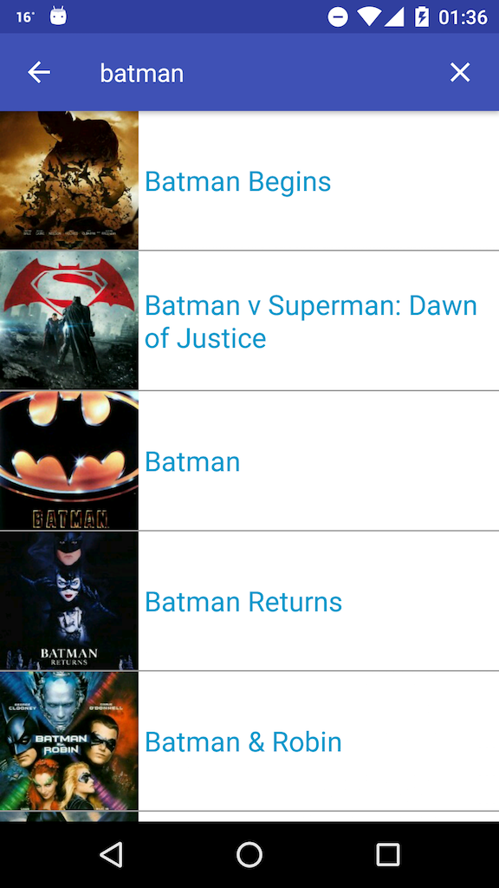
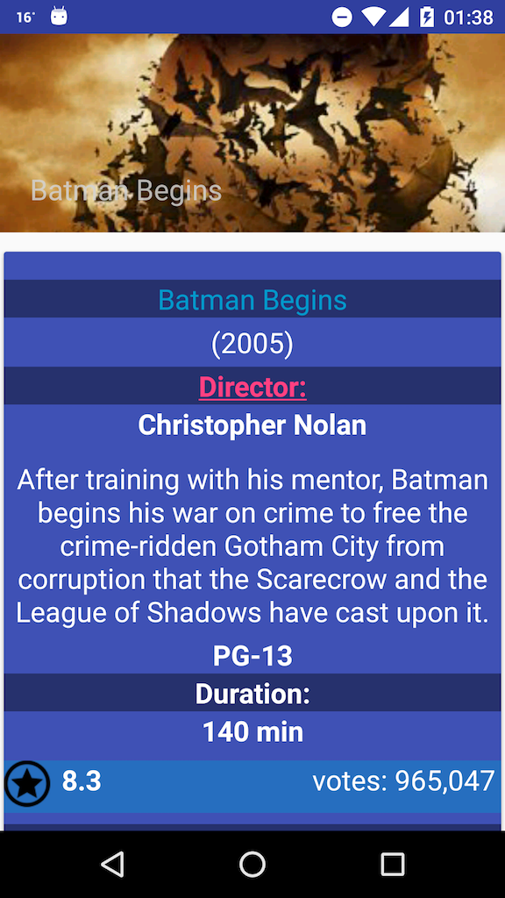

# Movies Finder
Movies Finder in combination with Material design can be aligned with *Clean architecture* with *Model-View-Presenter (MVP)*.

It is decoupled between `android` and `domain`.

But inside the android module, there are some good practices used.

There is an implementation of the *repository pattern* with a datasource (it could be extended to have a cache datasource in the future).
- the existing one is: API Rest Services data source

Moreover, by means of synchronised requests to the API, using `Retrofit` for this purpose for properly handling 
the different requests on threads with a pool of threads which passes their use cases result.

# Architecture design
The exchange between the different *layers* is as follows:
- **Repository layer**: 1) from the *data source* to the *Repository* (repository is the responsible of managing from 1 to n datasources) 2) from the *Repository* to their associated *Interactor* (or use case)
- **Interactor layer**: from the *Interactor*, , which are responsible of the business logic to the *Presenter*
- **Presenter layer**: from the *Presenter*, which provides the final formatted info to the passive `View` from a UI element (fragments / activities). Finally, this information would be passed through the UI thread.

Screenshots
-----------



Material design
---------------
- Movies Finder uses a wide range of Material design widgets from the Design support library such as:
- `AppBarLayout`, `CoordinatorLayout`, `Toolbar`, `RecyclerView`, `CardView`, `NestedScrollView`, `CollapsingToolbarLayout`


Features
--------
- Search for a movie when a user submits a query, then a list of search results will be displayed with a thumbnail
image and title if found any
- Error handling integrated for Internet connection issues or if 0 results achieved
- Once clicked an item, the detail view of an item is shown, which shows all the specific information such as: authors,
PEG, year, ranking, votes, etc
- A secret link is hidden after the *Author* field of every specific item (it launches a link)

Limitations
-----------
- For some unexpected reason the material design library 23.2.1 is hidden the back arrow button,
at the detail view. However, by clicking back button from your mobile you will achieve the same action.

SDK support
------------
Support SDKs from **15** to **23**

# Disclosure - Libraries used
- [Dagger 2](http://google.github.io/dagger/) for Dependency Injection
- [ButterKnife](http://jakewharton.github.io/butterknife/) v6.1.0 or Views Injection
- [Retrofit](http://square.github.io/retrofit/) v1.6.1 for API requests
- [Glide](https://github.com/bumptech/glide) v3.6.0 for Image rendering

# References (special thanks)
- [Uncle Bob: The Clean Architecture](https://blog.8thlight.com/uncle-bob/2012/08/13/the-clean-architecture.html)
- [The Repository pattern](https://msdn.microsoft.com/en-us/library/ff649690.aspx)
- [Effective Android UI](https://github.com/pedrovgs/EffectiveAndroidUI)
- [Android Clean Architecture](https://github.com/android10/Android-CleanArchitecture)

About the author
----------------
**Raul Hernandez Lopez**
in June 2016
**@RaulHernandezL**
**raul.h82@gmail.com**

License
---------
```
Copyright (C) 2016 Raul Hernandez Lopez

Licensed under the Apache License, Version 2.0 (the "License");
you may not use this file except in compliance with the License.
You may obtain a copy of the License at

http://www.apache.org/licenses/LICENSE-2.0

Unless required by applicable law or agreed to in writing, software
distributed under the License is distributed on an "AS IS" BASIS,
WITHOUT WARRANTIES OR CONDITIONS OF ANY KIND, either express or implied.
See the License for the specific language governing permissions and
limitations under the License.
```